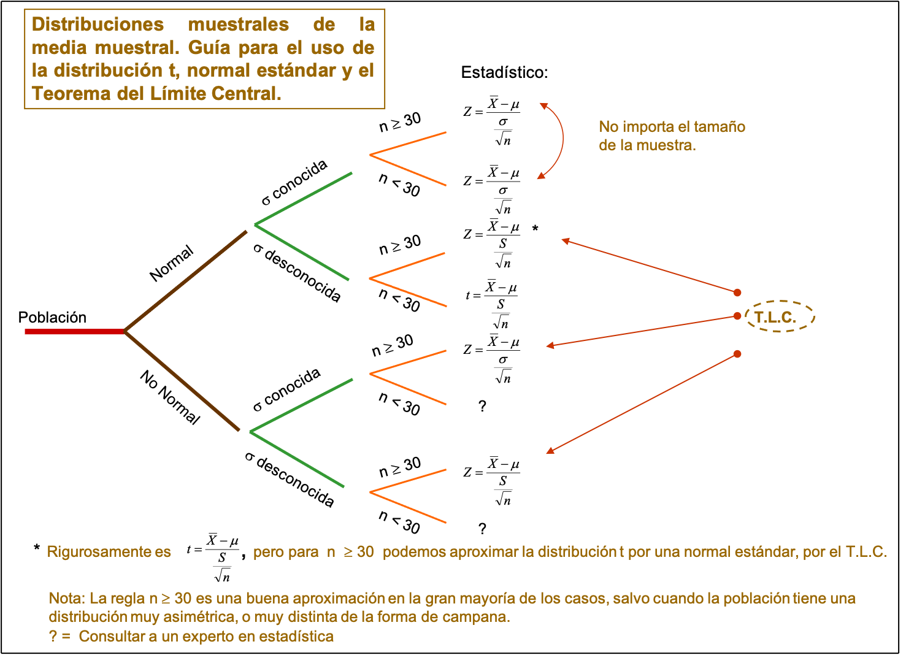

```{r setup, include=FALSE}
knitr::opts_chunk$set(echo = FALSE)


library(tidyverse)
library(patchwork)
library(ggExtra)
library(GGally)
# install.packages("devtools")
library(knitr)
library(kableExtra)
```


```{r minipage_funs, echo = FALSE}
## adding minipages in Rmarkdown only seems to work for me when returned from function
fig_table_mp_start <- function() {
  return("\\begin{minipage}{\\textwidth}")
}
fig_table_mp_end <- function() {
  return("\\end{minipage}")
}
```

# Distribuciones Muestrales

## Muestreo

- El muestreo es una herramienta de la investigación científica.
- Su función básica es determinar que parte de una realidad en estudio (población o universo) debe examinarse con la finalidad de hacer inferencias sobre dicha población. 


## Revisión de conceptos

- La información de  los estudios de muestreo es parte de nuestra vida diaria, casi en su totalidad. Tal información determina el rumbo que deberán tomar algunas políticas gubernamentales como, por ejemplo, la promoción de programas sociales o el control de la economía 

- Las encuestas de opinión son la base de muchas de las noticias proporcionadas en los medios. Los estudios de  rating televisivo determinan cuales son los programas que permanecerán al aire en el futuro.

- No se diga los estudios de preferencias electorales, para definir estrategias por parte de los partidos políticos. 

- Las investigaciones de mercado indicaran cuales productos y con que características son los preferidos de los consumidores 

- Por otro lado, están los estudios de muestreo en las ciencias biológicas, geológicas, del medio ambiente, marítimas entre otras.

- Muestreo de Aceptación (Industrial)

##

- Aún cuando la terminología de las ciencias sociales difiere de las ciencias exactas, los científicos sociales conducen estudios de muestreo y los científicos de las áreas físicas realizan en su mayoria experimentos, ambos tienen el propósito de captar información en torno a los fenómenos naturales.


- Sin embargo, esas diferencias existen en el campo de la ciencia, debido a la naturaleza de las poblaciones y a la manera en que una muestra puede ser extraída. Por ejemplo, poblaciones de votantes, de cuentas financieras, o de animales de una especie particular pueden contener un número relativamente pequeño de elementos (finito).

- En contraste, la población conceptual de respuestas generadas por la medición de la producción de un proceso químico, es muy grande (infinito). Las limitaciones del procedimiento de muestreo también varían de un área de la ciencia a otra.

- El muestreo en las ciencias biológicas y físicas, puede frecuentemente ser realizado bajo condiciones experimentales controladas. Tal control es frecuentemente imposible en las ciencias sociales, negocios, y administración de recursos naturales (observación).

## Un ejemplo: Población y muestra

### ¿Cómo realizar un inventario?

1. Censo: es un conteo exhaustivo de los individuos o elementos de la población bajo estudio.

Desventajas:

- Costos elevados.

- Estático

- Requiere mucho tiempo

2. Muestreo: una parte representativa del recurso.

Ventajas:

- Reduce costos.

- Puede ser dinámico

- Reduce tiempos. 

## Conceptos de Población y Muestra

- Se ha manejado que la estadística moderna es la teoría de la información, cuyo objetivo es la *inferencia.* Nuestro interés se centra en un grupo de mediciones  que existen o pueden ser generadas, una población. El medio de la inferencia es la muestra, la cual es un subgrupo de mediciones seleccionadas de la población.

- Deseamos entonces realizar inferencias sobre la población basándonos en las características que observamos en la muestra, o equivalentemente, en la  información contenida en la muestra.


## 

$N$ elementos de la población

{width=50%}

$n$ elementos de la muestra


## 

### Error de muestreo

- El error que se comete debido al hecho de que se obtienen conclusiones sobre cierta realidad a partir de la observación de sólo una parte de ella, se denomina **error de muestreo**.

- Obtener una muestra adecuada, significa lograr una versión simplificada de la población, que reproduzca de algún modo sus rasgos y características básicas o de interés.


## 

### Terminología

- **Elemento** es un objeto o persona en el cual se toman las mediciones.

- **Población objetivo**: conjunto de individuos de los que se quiere obtener información.

- **Unidades de muestro**: el conjunto de elementos no traslapados de la población que cubren a la población completa. Todo miembro de la población pertenecerá a una y sólo una unidad de muestreo.

- **Unidades de análisis**: objeto o individuo del que hay que obtener la información.

- **Marco muestral**: lista de unidades o elementos de muestreo. 

- **Muestra**: conjunto de unidades o elementos de análisis seleccionadas de un marco o varios marcos.

##

### Terminología

- **Muestreo probabilístico**.  El planteamiento clásico del problema de estimación estadística requiere que la aleatoriedad esté comprendida en el diseño de muestreo para así poder evaluar probabilísticamente, las propiedades de los estimadores. Al diseño de muestreo que plantea la selección, de unidades de muestreo, basada en la aleatoriedad se le llama *muestreo probabilístico*.

##

### Terminología

- **Límite para el error de estimación**. Si $\theta$ es la característica poblacional de interés y $\hat{\theta}$ es un estimador (basándose en la información de la muestra) de $\theta$, debemos especificar un límite para el error de estimación; esto es, debemos especificar que $\theta$ y $\hat{\theta}$ difieran en  valor absoluto a lo más en cierto valor $B$. Simbólicamente, $$\mbox{error de estimación}=|\theta - \hat{\theta} | < B$$

- $\theta$ puede ser cualquier característica de la población (el promedio, el total, un porcentaje, el valor mediano, el valor mínimo, etcétera) Se le llama **parámetro**.

- $\hat{\theta}$ es el **estadístico** obtenido a partir de la información de la muestra. En algunas veces llamado estadístico de prueba. (el promedio de la muestra, el total de la muestra, el mínimo de la muestra, la mediana de la muestra, etcétera)

##

### Parámetro poblacional vs Estadístico muestral


- **Parámetro:** Es una cantidad numérica calculada sobre una población 
  - La altura media de los individuos de un país
  - La idea es resumir toda la información que hay en la población en unos pocos números (parámetros).
 
- **Estadístico:** Es una cantidad numérica calculada sobre una muestra de la población 
  - La altura media de los que estamos en este aula.
    + ¿Somos una muestra de la población? ¿representativa?
  - Si un estadístico se usa para aproximar un parámetro también se le suele llamar estimador.[^1]

[^1]: Normalmente nos interesa conocer un parámetro, pero por la dificultad que conlleva estudiar a *TODA* la población, calculamos un estimador sobre una muestra y “confiamos” en que sean próximos. Más adelante veremos como elegir muestras para que el error sea “confiablemente” pequeño

##

|	         	  |	Población	  |	Muestra	|
|	:-------	  |	:-------	  |	:-------	|
|		          |	Parámetro	  |	Estadístico	|
|	Media	      | $\mu$		    | $\bar{x}$		|
|	Proporción	| $P$    		  |	$p$ 	|
|	Máximo	    |	$max$   	  |	$max$	|
|	Mediana	    |	$\tilde{x}$	|		|
|	Varianza  	|	$\sigma^2$	|	$s^2$	|
| Total       | $T$         | $\hat{T}$ |
|             | $\theta$    | $\hat{\theta}$ |

##

###

- También debemos definir una probabilidad, $(1-\alpha)$ que especifique la fracción de veces en muestreo repetido, que requeriremos que el error de estimación sea menor que $B$. Esto es 
$$P[\mbox{error de estimación} < B] = 1 - \alpha$$

### 

- **Muestreo no probabilístico**. El muestreo no probabilístico no involucra ningún elemento aleatorio en el proceso de selección.

##

Definición: Si $X_1, X_2, ..., X_n$ son **variables aleatorias** independientes e idénticamente distribuidas, decimos que constituyen una **muestra aleatoria** de la población **infinita** dada por su distribución común.

Si $S$ es un espacio muestral con una medida de probabilidad y $X$ es una función con valor real definida con respecto a los elementos de $S$, entonces $X$ se denomina **Variable Aleatoria**.

## Muestreo Aleatorio Simple (Población Finita)

###

Unas muestra aleatoria simple de tamaño $n$, de una población finita de tamaño $N$, es una muestra seleccionada de tal manera que cada una de las muestras posibles de tamaño $n$ tenga la misma probabilidad de ser seleccionada. 

## Distribución de Muestreo

### ¿Qué es una distribución muestral?

La distribución muestral de un estadístico de prueba proporciona 

1. una lista de todos los valores que puede tomar dicho estadístico y 
2. la probabilidad de obtener cada valor, suponiendo que éste es producto sólo del azar.


## Distribución muestral de la media

La distribución muestral de la media proporciona todos los valores que puede tomar la media, junto con la probabilidad de obtener cada valor si el muestreo es aleatorio a partir de la población hipotética. 

La media muestral posee las siguientes características:

1. $\mu_{\bar{x}}$= es la media de la distribución muestral de la media.

   $s_{\bar{x}}$ = es la desviación estándar de la distribución muestral de la media

2. La media muestral es igual a la media poblacional, $\mu_{\bar{x}}=\mu$.

3. La media muestral tiene una desviación estándar igual a la desviación estándar poblacional de datos crudos, dividida entre la raíz del número de datos. Es decir: $\sigma_{\bar{x}}=\frac{\sigma}{\sqrt{n}}$

4. Presenta una forma de campana.

## 

A pesar que la demostración de la distribución muestral de la media va más allá de los alcances del curso, podemos hacer un ejemplo para la mejor comprensión de la distribución muestral de la media.

Supongamos una población de solo cinco elementos $2, 3, 4, 5 \mbox{ y } 6$. La media $\mu$ de la población es $\mu = 4.0$ y la desviación estándar de la población es $\sigma = 1.41$.

Ahora queremos deducir la distribución muestral de la media para muestras de tamaño $2$ de la población. Extraemos (con reemplazo) todas las distintas muestras de tamaño $n = 2$. Y observamos cual es el valor de $\bar{x}$ y su probabilidad.

##

```{r}
dist.muestral <-expand.grid(2:6, 2:6)
dist.muestral <- dist.muestral %>% 
  mutate(promedio = rowMeans(select(., starts_with("V")), na.rm = TRUE),muestra = 1:n())
dist.muestral %>% kable(align = "cccr") %>% 
  kable_styling(font_size = 7) 
```

##


`r fig_table_mp_start()`

\btwocol

```{r, fig.align = "right", echo = FALSE}
freq.dist.muestral <- dist.muestral %>% 
  group_by(promedio) %>%
  summarize(conteo = n()) %>%
  mutate(p = conteo / sum(conteo))%>%
  ungroup() 
freq.dist.muestral %>% kable(align = "ccc",format = "latex")

```


```{r, fig.align = "right", echo = FALSE}

freq.dist.muestral %>% ggplot() +
  geom_segment( aes(x=promedio, xend=promedio, y=0, yend=p)) +
  theme_bw() +
  labs(y = "probabilidad") +
   theme(
    axis.text.x = element_text(size = 14),
    axis.text.y = element_text(size = 14),
    axis.title = element_text(size = 16)
  )
```


\etwocol

`r fig_table_mp_end()`

##

`r fig_table_mp_start()`

\btwocol


```{r}
dist.muestral <-expand.grid(2:6, 2:6)
dist.muestral <- dist.muestral %>% 
  mutate(promedio = rowMeans(select(., starts_with("V")), na.rm = TRUE),muestra = 1:n())
dist.muestral %>% kable(align = "cccr") %>% 
  kable_styling(font_size = 7) 
```

Media de la población
$$\mu = \frac{\sum X}{N} = 4.0$$

Media de la medias muestrales
$$\mu_{\bar{x}}=\frac{\sum \bar{x}}{m}= \frac{100}{25} = 4.0$$
Así, $\mu_{\bar{x}}=\mu$. También del resultado podemos verificar que:
$$\sigma_{\bar{x}}=\frac{\sigma}{\sqrt{n}}=\frac{1.41}{\sqrt{2}}=1.0$$
Pero podemos calcular directamente:

$$\sigma_{\bar{x}}=\sqrt{\frac{\sum (\bar{x}-\mu_{\bar{x}})^2}{m}}=$$ $$=\sqrt{\frac{(2-4)^2 + \cdots \ (6-4)^2}{25}}=1.0$$

\etwocol

`r fig_table_mp_end()`


##

### Distribución muestral de la media para N=5, con $\mu=4$, $\sigma=\sqrt{2}$ y $n=2$

`r fig_table_mp_start()`

\btwocol

```{r, fig.align = "right", echo = FALSE}
freq.dist.muestral <- dist.muestral %>% 
  group_by(promedio) %>%
  summarize(conteo = n()) %>%
  mutate(p = conteo / sum(conteo))%>%
  ungroup() 
freq.dist.muestral %>% kable(align = "ccc",format = "latex")

```


```{r, fig.align = "right", echo = FALSE}

freq.dist.muestral %>% ggplot() +
  geom_segment( aes(x=promedio, xend=promedio, y=0, yend=p)) +
  theme_bw() +
  labs(y = "probabilidad") +
   theme(
    axis.text.x = element_text(size = 14),
    axis.text.y = element_text(size = 14),
    axis.title = element_text(size = 16)
  )
```


\etwocol

`r fig_table_mp_end()`


##

### Distribución muestral de la media para N=5, con $\mu=4$, $\sigma=\sqrt{2}$ y $n=3$

`r fig_table_mp_start()`

\btwocol

```{r, fig.align = "right", echo = FALSE}
dist.muestral <-expand.grid(2:6, 2:6, 2:6)
dist.muestral <- dist.muestral %>% 
  mutate(promedio = rowMeans(select(., starts_with("V")), na.rm = TRUE),muestra = 1:n())
freq.dist.muestral <- dist.muestral %>% 
  group_by(promedio) %>%
  summarize(conteo = n()) %>%
  mutate(p = conteo / sum(conteo))%>%
  ungroup() 
freq.dist.muestral %>% kable(align = "cccc",format = "latex",digits=3)

```


```{r, fig.align = "right", echo = FALSE}

freq.dist.muestral %>% ggplot() +
  geom_segment( aes(x=promedio, xend=promedio, y=0, yend=p)) +
  theme_bw() +
  labs(y = "probabilidad") +
   theme(
    axis.text.x = element_text(size = 14),
    axis.text.y = element_text(size = 14),
    axis.title = element_text(size = 16)
  )
```


\etwocol

`r fig_table_mp_end()`


##

### Distribución muestral de la media para N=5, con $\mu=4$, $\sigma=\sqrt{2}$ y $n=9$


```{r, fig.align = "center", echo = FALSE,fig.height=5}
dist.muestral <-expand.grid(2:6, 2:6, 2:6,2:6, 2:6, 2:6,2:6, 2:6, 2:6)
dist.muestral <- dist.muestral %>% 
  mutate(promedio = rowMeans(select(., starts_with("V")), na.rm = TRUE),muestra = 1:n())
freq.dist.muestral <- dist.muestral %>% 
  group_by(promedio) %>%
  summarize(conteo = n()) %>%
  mutate(p = conteo / sum(conteo))%>%
  ungroup() 

freq.dist.muestral %>% ggplot() +
  geom_segment( aes(x=promedio, xend=promedio, y=0, yend=p)) +
  theme_bw() +
  labs(y = "probabilidad") +
   theme(
    axis.text.x = element_text(size = 14),
    axis.text.y = element_text(size = 14),
    axis.title = element_text(size = 16)
  )
```

Ver el archivo **distr_muestral_pequena.R** en  [https://rstudio.cloud/content/4731243](https://rstudio.cloud/content/4731243)

## Teorema del Límite Central

### Central Limit Theorem
Teorema: Si $X_1, X_2, \ldots, X_n$ constituyen una muestra aleatoria de una población infinita que tiene la media $\mu$ y la varianza $\sigma^2$, entonces la distribución límite de:
$$\bar{x} \sim N\left(\mu_{\bar{x}}=\mu,\sigma_{\bar{x}}=\frac{\sigma}{\sqrt{n}}\right)$$

cuando $n \to \infty$.  Si definimos 

$$Z=\frac{\bar{x}-\mu}{{\sigma}/{\sqrt{n}}}$$ 

entonces $Z \sim N(0,1)$ (la distribución normal estándar).

###

Una forma sencilla de expresar el teorema del límite central es: “la suma (o promedio) de $n$ variables aleatorias independientes e idénticamente distribuidas ($i.i.d.$), sigue una distribución límite normal con media $n\mu$ (ó $\mu$) y varianza $\sigma^2$ ($\sigma^2 /n$)".

## 

### Ejemplo

Una maquina vendedora de refrescos está programada para que la cantidad de refresco que se sirva sea una variable aleatoria con una media de $200$ mililitros y una desviación estándar de $15$ mililitros. ¿cuál es la probabilidad de que la cantidad de refresco promedio (media) servida en una muestra tomada al azar de $36$, sea cuando menos $204$ mililitros.

**Solución**

Según el TLC, la distribución de $\bar{x}$ tiene la media $\mu_{\bar{x}}=200$ y desviación estándar $s_{\bar{x}}=15/\sqrt{36}= 2.5$, y tiene una distribución que es aproximadamente normal. Como $z =(204 -200)/2.5 = 1.6$, podemos calcular la probabilidad $P(\bar{x} \ge 204) = P(z \ge 1.6) = 0.0548$.

##

Para que se alcance una distribución parecida a la normal en el conjunto de posibles promedios muestrales se requiere que $n$ sea grande. 

Sin embargo, la rapidez de acercamiento a la normal (velocidad de convergencia) también depende de la forma de la distribución de la variable en la población. 

Ver la siguiente liga de de una aplicación hecha en shinny donde se puede ver el histograma de promedios, donde sepuede modificar el  número de simulaciones y el tamaño de la muestra $n$ de cuatro distribuciones distintas.

 [https://s3rgionava.shinyapps.io/histograma_de_medias/](https://s3rgionava.shinyapps.io/histograma_de_medias/)


## Distribución de la media (población finita)

Si $\bar{x}$ es la media de una muestra aleatoria de tamaño $n$ tomada de una población finita de tamaño $N$ con media $\mu$ y la varianza $\sigma^2$, entonces:
$$E(\bar{x})=\mu \mbox{ y } Var(\bar{x})=\frac{\sigma^2}{n}\cdot\frac{N-n}{N-1}$$


## Distribución muestral de proporciones.

### Distribución Binomial

**Definición**: Si $X_1, X_2, \ldots, X_n$ son variables
aleatorias independientes e idénticamente
distribuidas ($i.i.d.$) que solo toman valores de $X_i = 1$ ó
$X_i = 0$, dependiendo si poseen o no la
característica de interés respectivamente,
decimos que constituyen una **muestra aleatoria de un experimento binomial** de la
población infinita dada por su distribución
común.

**Definición**: Si $X_1, X_2, \ldots, X_n$ 
constituyen una
muestra aleatoria de un experimento binomial,
entonces 
$$p=\frac{\sum_{i=1}^{n}x_i}{n}$$
se denomina **proporción de la muestra** y $$np(1-p)$$ es la **varianza de la muestra**.

##

{width=100%}

 [Para verlo a detalle hacer clic aquí](https://en.wikipedia.org/wiki/Relationships_among_probability_distributions#/media/File:Relationships_among_some_of_univariate_probability_distributions.jpg)


##

### Para un tamaño de muestra suficientemente grande

**Teorema**: Si $X_1, X_2, \ldots, X_n$ constituyen una
muestra aleatoria de una población infinita donde
$X_i$ constituye un experimento Bernoulli, tal que
que $P$ es la proporción de la población con la
característica de interés, entonces se cumple que:
$$E(p)=P \mbox{ y } Var(p)=\frac{p(1-p)}{n}$$
**Corolario**: De aquí y del TLC se tiene que la distribución límite de 
$$z=\frac{p-P}{\sqrt{\frac{p(1-p)}{n}}}$$
cuando $n \to \infty$ es normal estándar.

##

**Ejemplo** 

La proporción de familias de la ciudad
de Aguascalientes, que son dueñas (no
arrendatarias) de sus casas es de $0.70$. Si al azar
se entrevistan a $84$ familias de esta ciudad y sus
respectivas respuestas (a la pregunta de si son
dueñas o no de su casa) se consideran valores de
variables aleatorias independientes que tienen
distribución de Bernoulli idénticas con el
parámetro $P = 0.70$, ¿Con qué probabilidad
podemos afirmar que el valor que se obtenga de
la muestra $p$ será menor que $0.64$

**Respuesta**

$P = 0.70$, $p = 0.64$, $n = 84$, sustituyendo 
$$z=\frac{p-P}{\sqrt{\frac{p(1-p)}{n}}}=\frac{0.64-0.70}{\sqrt{\frac{0.64(0.36)}{84}}}= -1.1456$$

$$p(x<64)=p(z< -1.1456)=0.1259$$

##

### Aproximación para proporciones

También se puede ver este resultado como dada
una muestra aleatoria $X_1, X_2, \ldots, X_n$ de variables
aleatorias Bernoulli, con $x =\sum_{i=1}^n x_i$ el número de
éxitos observados, en $n$ intentos igualmente
probables, entonces la distribución límite de:
$$z=\frac{x-np}{\sqrt{n p (1-p)}}$$
con $p=x/n$, para $n \to \infty$, $z$ tiene una distribución límite normal estándar.


## Distribución t-Student

Si $\bar{x}$ y $s^2$ son la media y la varianza de una
muestra aleatoria de tamaño $n$ tomada de una
población **normal** con media $\mu$ ,
entonces
$$t=\frac{\bar{x}-\mu}{s/\sqrt{n}}$$ 

tiene una distribución *t-student* con $n-1$ grados de libertad.

Para usar la distribución normal es necesario conocer
el valor de la desviación estandar poblacional $\sigma$. Como es más
común el desconocimiento, entonces se estima $\sigma$ a
través de $s$ (desviación estándar muestral) y se usa la
distribución $t$.

$$z=\frac{\bar{x}-\mu}{\sigma /\sqrt{n}}$$

##

```{r}
base <-
  ggplot() +
  xlim(-5, 5)

base +
  geom_function(aes(colour = "normal"), fun = dnorm) +
  geom_function(aes(colour = "t, df =  1"), fun = dt, args = list(df = 1)) +
  geom_function(aes(colour = "t, df =  3"), fun = dt, args = list(df = 3)) +
  geom_function(aes(colour = "t, df =  9"), fun = dt, args = list(df = 9)) +
  geom_function(aes(colour = "t, df = 27"), fun = dt, args = list(df = 27)) +
  theme_classic() + 
  labs(y = "probabilidad",
       title = "Distribución t y normal estándar",
       x = "x")

```

##  

### Teorema

 Sea $Z$ una variable aleatoria normal estándar y $V$ una variable aleatoria chi cuadrada con $\nu$ grados de libertad. Si $Z$ y $V$ son independientes, entonces la distribución de la variable aleatoria $T$, donde
 $$T=\frac{Z}{\sqrt{V/\nu}}$$
está dada por la función de densidad
$$h(t)=\frac{\Gamma[(\nu+1)/2]}{\Gamma(\nu/2)\sqrt{\pi \nu}}\left(1+\frac{t^2}{\nu}\right)^{-(\nu +1)/2}\quad , -\infty <t<\infty$$
Ésta distribución se conoce como **distribución t** con $\nu$ grados de libertad.

##

### Corolario

Sean $X_1, X_2,\cdots, X_n$ variables aleatorias independientes norma les con media $\mu$ y desviación estándar $\sigma$. Sea
$$\bar{X}=\frac{1}{n}\sum_{i=1}^n X_i \qquad\mbox{ y } \qquad S^2=\frac{1}{n-1}\sum_{i=1}^n (X_i-\bar{X})^2.$$
Entonces la variable aleatoria $\frac{\bar{x}-\mu}{s/\sqrt{n}}$ tiene una distribución $t$ con $\nu=n-1$ grados de libertad.


##

### Ejemplo
Suponga que usted tiene una técnica que puede modificar
la edad a la cual los niños empiezan a hablar. En su
localidad, el promedio de edad, en la cual un niño emite
su primera palabra, es $13$ meses. No conoce la desviación
estandar poblacional. Usted aplica dicha técnica a una
muestra de $15$ niños. Los resultados son los siguientes:$8, 9, 10, 15, 18, 17, 12, 11, 7, 8, 10, 11, 8, 9, 12$.
$n = 15$, 
$\bar{x} = 11.0$, desviación estándar $s = 3.34$. Si la media
poblacional (verdadera) es $13$ meses, ¿cuál es la
probabilidad de encontrar un valor igual o menor de $\bar{x}$ de $11$ meses?

**Solución**

Se tiene que $\mu =13$, $s=3.34$, $\bar{x}=11$ y $n=15$.  Sustituyendo se obtiene

$$t=\frac{\bar{x}-\mu}{s/\sqrt{n}}=\frac{11-13}{3.34/\sqrt{15}}=-2.32$$
Por lo tanto $P(\bar{x}\le 11)=P(t \le -2.32) =$ `r pt(-2.32,14)`.

##

```{r}
funcShaded <- function(x) {
    y <- dt(x, df=14)
    y[x > -2.32] <- NA
    return(y)
}

base <-
  ggplot() +
  xlim(-5, 5)
desde <- -5
hasta <- -2.32
base +
  geom_function(aes(colour = "t, df = 14"), fun = dt, args = list(df = 14)) +
  stat_function(fun=funcShaded, geom="area", fill="#84CA72", alpha=0.2) +
  theme_classic() + 
  labs(y = "probabilidad",
       title = "P(t< -2.32) = 0.0179795",
       x = "x")

```

##

{width=90%}

## Distribución normal y las poblaciones discretas.

**Aplicaciones**

La distribución de normal se emplea
muchas veces como una aproximación
de valores en una población discreta.
En situaciones, debe tenrse especial
cuidado para asegurar que las
probabilidades se calculan de manera
precisa.

Considérese el siguiente ejemplo: Se
sabe que el Coeficiente de Inteligencia (CI) de una población está
distribuido normalmente en forma
aproximada con $\mu =100$ y $\sigma = 15$.
¿Cuál es la probabilidad de que un
individuo seleccionado al azar tenga un
CI de por lo menos 125? Si se hace $X
= IC$ de una persona elegida al azar,
deseamos $P(X \ge 125)$.

La tentación aquí es estandarizar
como en los ejemplos anteriores. Sin
embargo, la población del CI es
discreta en realidad, ya que los CI
son de valor entero, y la curva normal
es una aproximación a un histograma
de probabilidad discreta.

##

Los rectángulos del histograma están
centrados como enteros, y los CI de por
lo menos 125 corresponden a
rectángulos que se inician en 124.5.
En realidad deseamos $P(X \ge 124.5)$,
que ahora se puede estandarizar para
obtener $P(Z \ge 1.63) = 0.0516$.

Si hubieramos estandarizado $X \ge 125$,
habríamos obtenido $P(Z \ge 1.67) = 0.0475$. La diferencia no es grande,
pero la respuesta $0.0516$ es más precisa.
Análogamente, $P(X = 125)$ sería más
apropiado por el área entre $124.5$ y
$125.5$. Ya que el área bajo la curva
normal arriba del valor único de $125$ es
cero.

La corrección para la discretización de
la distribución subyacente se llama con
frecuencia **corrección de continuidad**.
Es útil en la siguiente aplicación de la
distribución normal

## Aproximación de la distribución binomial a la distribución normal.

Recordemos que el valor medio y la desviación
estándar de una variable aleatoria $X$ binomial
son $\mu_X = np$ $\sigma_X = \sqrt{npq}$, respectivamente. El
siguiente histograma muestra una distribución
binomial con $n = 20$, $p = 0.6$ (así que $\mu = 12$, $\sigma = [20(0.6)(0.4)]^{1/2} = 2.19$).

```{r, fig.height=4}

n <-20
p<- 0.6
data.frame(exitos = 0:n, prob = dbinom(x = 0:n, size = n, prob = p)) %>%
  ggplot() +
  geom_bar(aes(x=exitos,y=prob),stat = "identity",fill="#3277A8", alpha=0.2) +
  labs(title = "Probabilidad Binomial.",
       subtitle = paste("Bin(",n,", ",p,")"),
       x = "Éxitos (x)",
       y = "probabilidad") +
  theme_bw()


```

##

Una curva normal con valor medio y
desviación estándar igual a los valores
correspondientes para la distribución
binomial se ha sobrepuesto en el
histograma de probabilidad. Aun cuando el
histograma esta un poco sesgado (porque $p \ne 0.5$), la curva normal da una buena
aproximación, en especial en la parte
media de la figura.

```{r, fig.height=4}

n <-20
p<- 0.6
data.frame(exitos = 0:n, prob = dbinom(x = 0:n, size = n, prob = p)) %>%
  ggplot() +
  geom_bar(aes(x=exitos,y=prob),stat = "identity",fill="#3277A8", alpha=0.2) +
  labs(title = "Probabilidad Binomial.",
       subtitle = paste("Bin(",n,", ",p,")"),
       x = "Éxitos (x)",
       y = "probabilidad") +
  geom_function(aes(colour = "normal"), fun = dnorm,args = list(mean = n*p ,sd =sqrt(n*p*(1-p)))) +
  theme_bw()


```


##


`r fig_table_mp_start()`

\btwocol


```{r, echo=FALSE}
n <- 20
p <- 0.6
x <- 0:20
proba <- dbinom(x,size=n,prob=p)
normal <- pnorm(x+.5, mean=n*p, sd=sqrt(n*p*(1-p))) - pnorm(x-.5, mean=n*p, sd=sqrt(n*p*(1-p)))
data.frame(x,Binomial=proba,Normal=normal) %>% 
  kable(align = "ccc",digits=3) %>% 
  kable_styling(font_size = 9) 
```

Para el caso binomial: Tenemos que $X\sim Binom(n,p)$
$$P(X=x;n,p)= \binom{n}{x}p^x (1-p)^{n-x}.$$
Si definimos $\mu=np$, $\sigma=\sqrt{np(1-p)}$, podemos aproximar a $X$ mediante la variable $Y\sim N(\mu,\sigma)$ si calculamos de la siguiente forma:
$$P(X=x) \approx P(x-.5 \le Y \le x+.5)$$
$$=P\left(\frac{[x-.5] - \mu}{\sigma} \le Z\le \frac{[x+.5]- \mu}{\sigma}\right)$$


\etwocol

`r fig_table_mp_end()`


##

El área de cualquier rectángulo (probabilidad de
cualquier valor de $X$ particular), excepto los de
las colas de los extremos, se puede aproximar
con presición mediante el área de la curva
normal correspondiente. 

Por ejemplo, $P(X = 10) = b(X=10; n =20, p = 0.6) = 0.117$, mientras que
el área bajo la curva normal entre $9.5$ y $10.5$ es
$P(-1.14 < Z < -0.68) = 0.120$.

Más generalmente, mientras el histograma de
probabilidad binomial no esté demasiado
sesgado, las probabilidades binomiales se
pueden aproximar bien por áreas de curva normal.
Se dice entonces que $X$ tiene aproximadamente
una distribución normal.

## 

**Proposición** : Sea $X$ una V.A. Binomial basada en $n$
intentos con probabilidad de éxito $p$.
Entonces, si el histograma de probabilidad
binomial no está demasiado sesgado, $X$
tiene aproximadamente una distribución
normal con $\mu = np$ y $\sigma = \sqrt{npq}$.

En particular, para $x =$ un valor posible de
$X$, $P(X \le x) = B(x;n,p)  \approx$ (área bajo la curva
normal estándar a la izquierda de $x + 0.5$), es decir

$$P(X \le x) = B(x;n,p)  \approx \Phi \left( \frac{x+0.5-np}{\sqrt{np(1-p)}}\right)$$

En la práctica la aproximación es adecuada si $np \ge 5$ y $n(1-p) \ge 5$.

## Papel De Probabilidad Normal

La gráfica de papel de Probabilidad Normal, o
simplemente gráfica de probabilidad normal,
es un procedimiento útil para verificar si un
conjunto de datos puede ser adecuadamente
modelado por una distribución normal
(Bondad de Ajuste). Este procedimiento
consiste en construir una gráfica en el plano
cartesiano, en donde, *en el eje horizontal se grafican los datos* y *en el eje vertical la probabilidad empírica (acumulada)* de los
datos sobre una *escala de probabilidad normal*.

Es decir, es una gráfica que representa la
distribución normal acumulada de los datos
sobre una escala de probabilidad normal. Para
construir la gráfica de probabilidad normal,
deben disponerse los datos en orden
ascendente y dibujar el $k-ésimo$ de estos datos
ordenados contra su punto de probabilidad
acumulada $Pk = (k - 1/2)/N$ sobre papel de
probabilidad normal. Si la distribución de los
datos es normal, esta gráfica deberá parecer
una línea recta.

##


`r fig_table_mp_start()`

\btwocol


```{r}
datos <-c(-3.8, -3.6, -3.4, -3.4, -2.8,-2.8,-2.6,-2.6,-0.8,-0.8,0.2,0.2,0.4,0.4,
          0.4,1.2,1.4,1.4,1.4,1.6,2.6,2.6,3.4,4.2,5.2)
set.seed(19)
matrix(sample(datos),nrow = 5) %>% kable()
```


```{r, fig.align = "right", echo = FALSE}
k <- 1:length(datos)
pk <- (k -.5)/length(datos)
tabla <- data.frame(k,x=datos,Pk=pk)
tabla %>% kable(align = "ccc",digits=2) %>% 
  kable_styling(font_size = 7) 

```


\etwocol

`r fig_table_mp_end()`


##


##

```{r}
qqnorm(tabla$x)
tabla %>% ggplot(aes(sample = x)) + stat_qq() + theme_bw()
```


## Distribución Ji-cuadrada (Chi-Square)

Hemos visto que el conocer la varianza
$\sigma^2$ resulta fundamental para procedimientos de
distribución muestral de la media, así como para
procedimientos de inferencia estadística. 

Existen
muchas aplicaciones prácticas en donde $\sigma^2$ es el
objetivo
primario
de
la
investigación
experimental. (Precisión en el llenado de bolsas).
En estos casos $\sigma^2$ adquiere una mayor
importancia que la media de la población.

Las partes producidas por un proceso de
manufactura deben ser producidas con un
mínimo de variabilidad para reducir el número de
productos
fuera
del
rango
aceptable
(defectuosos). En general se desea mantener una
varianza mínima en las características de calidad
de un producto industrial para alcanzar el control
del proceso y minimizar el porcentaje de
productos de baja calidad.

##

La varianza muestral

$$s^2=\frac{\sum_{i=1}^n (x_i -\bar{x})}{n-1}.$$

Es un estimador insesgado de la varianza de la
población $\sigma^2$. La distribución muestral de $s^2$,
generada mediante muestras repetidas, es una
distribución de probabilidad que empieza en $s^2 = 0$ (ya que no puede ser negativa) con media igual
a $\sigma^2$. La distribución **no es simétrica**.

La forma de la distribución depende del número
de datos, así como de la forma de la distribución
de origen.

##

### En el caso de población normal

Si la población de origen de las muestras es normal, entonces la distribución
estandarizada que se obtiene es la Ji- cuadrada,
calculada como en la siguiente expresión:

$$\chi^2=\frac{(n-1)s^2}{\sigma^2}$$

### Relación de la Ji-cuadrada con la distribución normal

Si $Z \sim N(0,1)$,
entonces $Z^2$ tiene la distribución gama
especial a la que nos referimos como la
distribución $ji-cuadrada$ con $\nu = 1$ **grado de libertad**. La Ji-cuadrada es importante
en problemas de muestreo de poblaciones
normales.

En general si $Z_i \sim N(0,1)$, $i=1,2,\ldots,n$ independientes, entonces 
$$X=Z_1^2 +Z_2^2+\cdots+Z_n^2$$
entonces $X\sim\chi_n^2$.

## 


### Distribución Ji-cuadrada

Una variable aleatoria $x$ tiene una
distribución ji-cuadrada ($\chi^2$) con $\nu$ (nu)
grados de libertad, si su densidad está dada
por:

$$f(x)=\frac{1}{2^{\frac{\nu}{2}}\Gamma(\nu/2)}x^{\frac{\nu-2}{2}}e^{-x/2} \mbox{ para } x>0$$


### Función Gama

$$\Gamma(\alpha)=\int_0^\infty y^{\alpha -1}e^{-y}dy \qquad \mbox{ para } \alpha >0$$

Casos importantes:
$\Gamma(1/2)=\sqrt{\pi}$

$\Gamma(k)= (k-1)!$ para $k$ entero.

##

```{r, fig.height=6}
base <-
  ggplot() +
  xlim(0, 25)

base +
  geom_function(aes(colour = "ji-cuadrada, df =  1"), fun = dchisq, args = list(df = 1)) +
  geom_function(aes(colour = "ji-cuadrada, df =  3"), fun = dchisq, args = list(df = 3)) +
  geom_function(aes(colour = "ji-cuadrada, df =  9"), fun = dchisq, args = list(df = 9)) +
  geom_function(aes(colour = "ji-cuadrada, df = 12"), fun = dchisq, args = list(df = 12)) +
  theme_classic() + 
  labs(y = "probabilidad",
       title = "Distribución ji-cuadrada",
       x = "x")
```


## 

### Estimación de Varianzas

**Teorema**. Si $s^2$ es la varianza de una
muestra aleatoria de tamaño $n$ tomada de
una población normal cuya varianza es $\sigma^2$,
entonces:

$$\chi^2=\frac{(n-1)s^2}{\sigma^2}$$
es el valor de una variable aleatoria que
tiene distribución Ji-cuadrada con
parámetro $\gamma = \nu - 1$ grados de libertad.

\bigskip
Exactamente 95% de una distribución chi cuadrada cae entre $\chi_{0.975}^2$
 y $\chi_{0.025}^2$. Un valor $\chi^2$ que cae a la derecha de $\chi_{0.975}^2$ no tiene probabilidades de ocurrir, a menos que el valor de $\sigma^2$ que supusimos sea demasiado pequeño. Lo mismo sucede con un valor $\chi^2$
que cae a la izquierda de $\chi_{0.025}^2$, el cual tampoco es probable que ocurra, a menos que
el valor de $\sigma^2$ que supusimos sea demasiado grande. En otras palabras, es posible tener
un valor $\chi^2$ a la izquierda de $\chi_{0.025}^2$ o a la derecha de $\chi_{0.975}^2$ cuando el valor de $\sigma^2$ es correcto; pero si esto sucediera, lo más probable es que el valor de $\sigma^2$ que se supuso sea
un error.

##

### Ejemplo

Un fabricante de baterías para automóvil garantiza que su producto durará, en promedio,
$3$ años con una desviación estándar de $1$ año. Si cinco de estas baterías tienen duraciones
de $1.9, 2.4, 3.0, 3.5\mbox{ y }4.2$ años, ¿el fabricante continuará convencido de que sus baterías
tienen una desviación estándar de $1$ año? Suponga que las duraciones de las baterías siguen
una distribución normal.

**Solución**

Primero calculemos la  media y varianza, muestrales: 
$$\bar{x}=3 \qquad \mbox{y} \qquad s^2 = \frac{(1.9-3)^2 + (2.4-3)^2 + \cdots + (4.2-3)^2}{4}=0.815$$
Entonces
$$\chi^2=\frac{(4)(0.815)}{1}=3.26$$
es un valor de una distribución chi cuadrada con $4$ grados de libertad. Como $95\%$ de los valores $\chi^2$ con $4$ grados de libertad caen entre `r round(qchisq(.025,4),3)` y `r round(qchisq(.975,4),3)`, el valor calculado con
$\sigma^2 = 1$ es razonable y, por lo tanto, el fabricante no tiene razones para sospechar que la
desviación estándar no sea igual a $1$ año.

